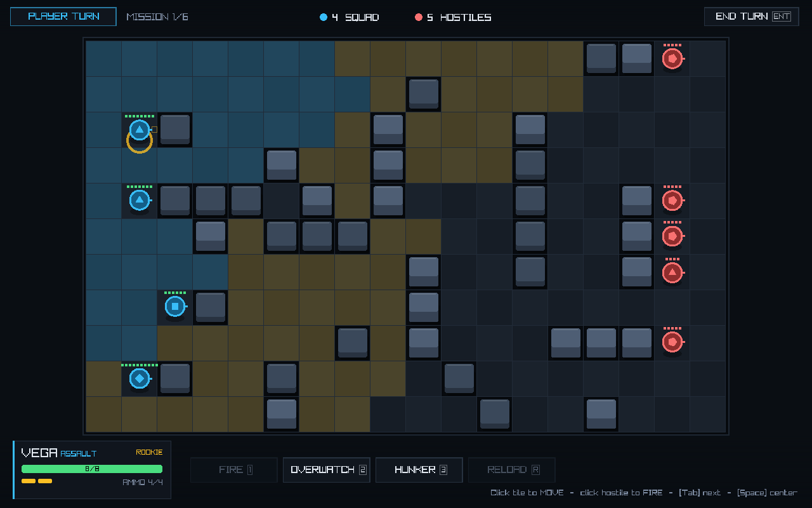

# SIGHTLINE — Turn-Based Squad Tactics

A compact, XCOM-style tactics game built in **C# + [Raylib](https://www.raylib.com/)**.
Command a four-soldier squad on a grid battlefield: spend action points, use cover,
flank the enemy, set overwatch, and wipe the hostiles before they wipe you.

Almost everything is generated: the board is geometry, particles, procedural
textures and shaders, and every sound effect and music bed is **synthesised at
runtime** — no recorded audio ships. The only committed binaries are two text
fonts (Noto Mono and Chakra Petch, both SIL Open Font License 1.1, full licence
text in `assets/`) and the screenshot below. A whole distributable build is
**29.3 MB across 10 files** (MB = 10^6 bytes), self-contained: no .NET install
needed on the target machine. It runs natively on Linux, macOS and Windows.



## The game loop

- **Two actions per soldier.** Firing costs one action and does *not* end the
  turn, so **where you stand after shooting is the real bet** — shoot then
  reposition, or spend the second action on a rushed follow-up shot. A
  double-move ("dash") spends both actions.
- **Cover is everything.** Stand beside a wall and incoming aim drops sharply
  (low cover −20, high cover −40). Get **flanked** — hit from a side your cover
  doesn't block — and you're exposed *and* far more likely to be crit.
- **Percentage-to-hit** based on aim, weapon, range profile, and the target's cover.
  Hover any hostile to see hit %, crit % and damage before you commit.
- **Overwatch** holds a reaction shot: any enemy that moves through your sights
  gets fired on automatically (and vice-versa).
- **Hunker** trades your turn for extra defence and crit immunity.
- **Grenades** lob over cover for guaranteed AoE damage and blow apart low cover —
  but they hit your own soldiers too, so mind the blast.
- **Hostiles lurk in pods**: a group stays dormant (shown dimmed, marked `?`)
  until a soldier spots it, then it wakes and scrambles to cover. Scouting ahead
  is a real risk — push too far and you can wake two pods at once.
- Clear all hostiles to win the mission; lose a mission if the whole squad falls.

### The campaign (run-to-run loop)

A run is **six escalating missions** played with a single, persistent squad:

- Survivors carry their **wounds and ranks** into the next mission (a partial
  field-heal happens between missions — damage matters).
- **Kills earn promotions.** Rookie → Squaddie → Corporal → … → Colonel, each
  rank granting a stat bump (+Aim / +HP / +Mobility).
- A **barracks debrief** between missions shows survivors, promotions, heals and
  the fallen — and **fresh rookies backfill** any empty slots so a bad mission
  doesn't doom the run — then deploys you to a tougher fight.
- Missions vary by **objective** — eliminate, extract, hack, escort, sabotage,
  rescue, hold, decapitate — dealt so every route mixes them, and the **opening
  geometry varies too**: a frontal push, a pincer, a crossfire, or an envelop
  that starts you surrounded.
- Lose the whole squad and the run ends; clear all six and the campaign is won.

### Soldiers & weapons

| Class | Default weapon | Identity | Signature ability |
|-------|----------------|----------|-------------------|
| Assault | Rifle | Balanced front-liner — pushes up and cracks open cover | GRAPPLE — yank a foe out of cover |
| Ranger | Shotgun | Fast flanker — brutal up close, useless at range | SLIPSTREAM — a free, overwatch-safe reposition |
| Sharpshooter | Marksman rifle | Rewards distance, high crit; weak point-blank | MARK — a focus-fire designator |
| Gunner | LMG | Tanky, big magazine — suppresses and denies zones | SUPPR. FIRE — area-denial pin |
| Corpsman | SMG | Field medic — the squad's only in-combat sustain | PATCH — heal an adjacent squadmate |

The ARMORY offers each class a small thematic weapon pool (the default leads it), and every
class carries a one-charge **utility item** — smoke, flashbang, barricade or incendiary, by class.
Each weapon has its own range curve, crit rate, and clip size, so positioning
and reloads matter.

## Controls

Every verb is also a button on the action bar, labelled with its key — you never have to
memorise this. The game teaches the verbs as they become relevant (there is a **TRAINING OP**
on the main menu, and a **FIELD MANUAL** you can open with `K` from the main menu, the barracks
and the pause card; its VERBS & KEYS tab is this list).

**The tables below are generated, not typed.** `SIGHTLINE_KEYTABLE=1 bin/Release/net8.0/Sightline`
prints them from the same tables the action bar, the main menu's plates and the FIELD MANUAL draw
from (`Hud.VerbTable`, `Hud.KeyTable`, `Hud.IntroDoors` + `Game.IntroKeys`), so a rebinding reaches
this file by regenerating, never by hand-editing. To refresh: run the hook and paste its output
between the two `KEYTABLE` markers. The set of bound keys it must cover is derived with
`grep -ohE 'KeyboardKey\.[A-Z][a-z0-9]*' src/*.cs | sort -u`.

<!-- KEYTABLE:BEGIN — generated by SIGHTLINE_KEYTABLE=1; regenerate, do not hand-edit -->
**In a mission - the verbs** (every one is also a button on the action bar, labelled with its key)

| Key / verb | What it does |
|------------|--------------|
| **1** / FIRE | Aimed shot at a target in range + line of sight. Full aim, costs 1 action and does NOT end the turn — keep your other action to reposition (one shot/turn). |
| **4** / GRENADE | Lob a grenade: AoE that ignores cover, hits both teams, clears low cover. |
| **5** / ABILITY | Your class's signature ability, on a cooldown. PATCH / GRAPPLE / MARK / SLIPSTREAM / SUPPR. FIRE - see the CLASSES tab for which soldier carries which. |
| **6** / UTILITY ITEM | Your class's utility throwable, ONE charge per mission. SMOKE blocks line of sight and overwatch through it; FLASH disorients everyone in the blast; BARRICADE drops low cover on an empty tile; INCENDIARY sets a 3x3 fire field. |
| **8** / SHOVE | Shove an adjacent enemy 1 tile back (breaks its overwatch + exposes it). Blocked = collision damage. 1 action, won't end your turn, once/turn. |
| **7** / DRAG | Pull an adjacent ally 1 tile toward you (saves wounded, carries the downed, speeds the march to evac). 1 action, won't end your turn, once/turn. |
| **9** / VAULT | Leap an adjacent cover tile to the open floor beyond it - cross an impassable screen to flank or escape. 1 action, won't end your turn, once/turn. |
| **2** / OVERWATCH | Watch: fire a reaction shot at the first foe that moves in sight. |
| **F** / FOCUS | Braced kill-lane: reaction fire only inside a 90-degree cone toward the aimed tile, but at +aim. Blind outside the cone. |
| **B** / BRACE | Brace a DISRUPTING reaction: on a hit it STAGGERS the mover (denies its action this turn) for reduced damage. Deny the enemy's alpha instead of going for the kill. |
| **3** / HUNKER | Hunker down for extra cover defense; you can't be crit. |
| **H** / HACK / PLANT | Work the objective site: HACK a terminal, or PLANT a demolition charge on a sabotage target. Costs 1 action. |
| **G** / BEACON | Deploy a forward evac beacon on your tile: opens a 3x3 extraction zone right here (in addition to the far corner). One per mission. Costs 1 action, won't end your turn. |
| **X** / EXTRACT | Haul an adjacent ally / asset aboard - pulls them into the extraction zone. Costs 1 action. |
| **E** / STABILIZE | Stop an adjacent DOWNED soldier's bleed-out - the timer freezes and they hold on (still down: drag them, or win the field and they recover). A corpsman's PATCH gets them back up. 1 action, won't end your turn. |
| **R** / RELOAD | Reload your weapon to full. |

**Selecting & Moving**

| Input | Action |
|-------|--------|
| **Left-click a soldier** | select it |
| **Left-click a tile** | move there - inside the cyan outline is one action, the dashed outer ring is a dash (both actions) |
| **Left-click a hostile** | fire on it |
| **hold Shift** | reveal the dash / sprint region in the move overlay |
| **Tab** | cycle to the next soldier |
| **Arrows / WASD** | drive the keyboard cursor |
| **Space** | act on the cursor tile (move, fire, or the armed verb) |
| **Enter** | end the turn |
| **Esc / Right-click** | cancel an aim or targeting mode; Esc again opens the pause card |

**Camera**

| Input | Action |
|-------|--------|
| **Wheel** | zoom |
| **Middle-drag** | pan |
| **C** | reset the camera (AUTO-CAM on the pause card follows the action on its own) |

**In a Mission**

| Input | Action |
|-------|--------|
| **T** | write a custom tag on the selected soldier (Enter confirms, Backspace edits, Esc cancels) |
| **V** | show every verb while the onboarding is still staging the action bar |
| **P** | restart the drill (TRAINING OP only) |

**Everywhere**

| Input | Action |
|-------|--------|
| **Esc** | the pause card in a fight; the same card opens as SETTINGS on the main menu and in the barracks |
| **K** | FIELD MANUAL - from the main menu, the barracks and the pause card (Esc or K closes it) |
| **Q** | QUIT TO DESKTOP - from the pause card (arm, then confirm) or the main menu |
| **M** | mute / unmute |
| **F11** | fullscreen |
| **F2** | cycle animation speed |

**Main Menu**

| Input | Action |
|-------|--------|
| **ENTER** / DEPLOY SQUAD | NEW CAMPAIGN - draft a squad, pick a doctrine, survive 6 operations |
| **C** / CONTINUE RUN | CONTINUE - resume your saved campaign run (only while a save exists) |
| **N** / TRAINING OP | TRAINING OP - a short live-fire drill; nothing is saved, restart it any time |
| **L** / LAST STAND | LAST STAND - endless horde survival; how many waves can you hold? |
| **W** / WAR ROOM | WAR ROOM - spend salvage on unlocks; achievements + hall of fame |
| **K** / FIELD MANUAL | FIELD MANUAL - every enemy, class and rule in one reference |
| **S** / SKIRMISH | SKIRMISH - one custom fight; pick the objective and the heat |
| **Y** / DAILY | DAILY - today's seeded run, one attempt, ranked by turns |
| **U** / AUDIO CHECK | AUDIO CHECK - hear every cue, sweep the music, move the mix; measured numbers beside each |
| **O** / SETTINGS | SETTINGS - text size, colourblind palette, brightness, gamma, animation speed, the mix |
| **Q** / QUIT | QUIT - close the game; a campaign in progress resumes from its last mission start |
| **Left / Right, A / D, Kp- / Kp+** | dial the DIFFICULTY card (RECRUIT, STANDARD, HEAT 1-8 as earned) |

**Other Screens**

| Input | Action |
|-------|--------|
| **DRAFT: Enter / R / Esc** | deploy the founding squad / re-roll the pool / back |
| **BARRACKS: Enter / A / Esc / K** | proceed to deployment / open or close the ARMORY / SETTINGS (or back out of the ARMORY) / FIELD MANUAL |
| **END CARD: Enter / W / Esc** | new run (after TRAINING OP: run the drill again) / WAR ROOM / main menu |
| **FIELD MANUAL: Up / Down (W / S), hold Left / Right (A / D), Esc / K** | change tab / scroll / back |
| **SKIRMISH SETUP: Left / Right (A / D), Up / Down (W / S, + / -), Enter, Esc** | objective / heat / deploy / back |
| **AUDIO CHECK: Esc or U, M** | back / mute |
| **WAR ROOM: Esc** | back |
<!-- KEYTABLE:END -->

The pause card (`Esc`) carries the rest: window size, brightness, gamma, colourblind palette,
screen shake, threat preview, animation speed, **text size**, and the four-channel audio mix.
The same card opens as **SETTINGS** from the main menu (`O` or `Esc`) and from the barracks
(`Esc`), so text size and the colourblind palette can be set before the first fight.
It also shows the build version, which is what to quote in a bug report.

## Build & run

Requires the **[.NET 8 SDK](https://dotnet.microsoft.com/download)** (cross-platform).

```bash
# from the project root
dotnet run -c Release
```

To produce a standalone distributable (no SDK needed to run it), use the publish script —
**not** a bare `dotnet publish`:

```bash
bash scripts/publish.sh                 # -> dist/linux-x64-release/  (29.3 MB, 10 files)
bash scripts/publish.sh --rid win-x64   # or osx-x64 / osx-arm64
```

The script exists because the recommended configuration is trimmed, and a trimmed build once
compiled with 0 errors, booted, played a whole campaign and **saved nothing at all**. So it
re-runs the persistence and shipping self-tests against the binary it just built and refuses to
report success if any of them fail. **Ship the whole output directory**, not just the executable:
`libraylib.so` is `dlopen()`ed at runtime and cannot be linked in, and `assets/`,
`THIRD-PARTY-NOTICES.txt` and `LICENSE` are licence obligations, not extras. Details, the measured
size/startup matrix and where player data lives: [`docs/DISTRIBUTION.md`](docs/DISTRIBUTION.md).

## Licence

The game's own source is **all rights reserved** — see [`LICENSE`](LICENSE), which explicitly does
*not* restrict distributing compiled builds. Bundled third-party components (raylib and Raylib-cs
under Zlib, the .NET runtime under MIT, Noto Mono and Chakra Petch under the SIL Open Font License)
keep their own terms; the notices are in `THIRD-PARTY-NOTICES.txt` and both fonts ship their full
OFL text beside them in `assets/`.

### In Rider (recommended IDE)

Use **Rider** — this is a C#/.NET project. (Don't use CLion: that's for C/C++ via
CMake and there's no `CMakeLists.txt` here.)

1. **Open** the project folder (or `Sightline.csproj`) — not "New CMake project".
2. A shared **Sightline** run configuration is committed under `.run/`, so the
   green ▶ Run button is ready immediately on a fresh clone — just hit Run
   (Shift+F10). It builds then launches the game.

The Raylib native libraries are pulled in automatically via the `Raylib-cs`
NuGet package (needs internet on first restore). Requires the .NET 8 SDK, which
Rider can install/detect for you.

## Project layout

Every file in `src/` (the authoritative map, with the gotchas, is `CLAUDE.md`):

```
src/
  Program.cs           entry point + window loop + the env-gated harness (every SIGHTLINE_* hook)
  Game.cs              state machine, input, turn flow, overwatch, AI staging (a partial class)
  Game.Autopilot.cs    the headless smoke-test / balance AI
  Game.Harness.cs      every Debug* screenshot stager and *SelfTest hook (headless-only)
  Game.Endless.cs      LAST STAND (endless horde) mode
  Game.Modes.cs        SKIRMISH + seeded DAILY
  Game.Meta.cs         WAR ROOM screen state + input
  Game.Codex.cs        FIELD MANUAL screen state + input
  Game.Audition.cs     AUDIO CHECK screen state + input
  Grid.cs              battlefield, line-of-sight (Bresenham), cover queries, 8-dir pathfinding
  Terrain.cs           the per-tile biome GROUND layer (undergrowth / slick ice / thermal vents)
  Unit.cs              soldiers, weapons, classes, stats; per-weapon range curves
  Combat.cs            hit / crit / damage math (ComputeOdds + Resolve)
  Ai.cs                enemy decision-making (seek cover + line of fire, flank, finish, decline)
  Anim.cs              sequential move / shot / grenade animations
  Fx.cs                particles, floating combat text, screen shake, ambient atmosphere
  Renderer.cs          battlefield, cover, units, overlays, the aim reticle
  Hud.cs               bars, action buttons, tooltips, overlays and every screen's chrome
  Hud.Audition.cs      the AUDIO CHECK screen's drawing
  Display.cs           render target, post-FX shader, brightness / colourblind, the settings file
  Audio.cs             procedural SFX + music (file-first: drop <cue>.ogg into assets/sfx/)
  Audio.Analysis.cs    the measured numbers the AUDIO CHECK screen prints beside each cue
  Util.cs              layout constants, palette, math / rng / easing, the text routing
  Maps.cs              hand-authored ASCII arena templates
  Mission.cs           builds battlefields and squads; every hostile passes through MakeHostile
  Run.cs               the persistent campaign run (squad, map, intel, boons, the heat ladder)
  Meta.cs              the cross-run profile (salvage, achievements, unlocks)
  Events.cs            between-mission field events
  Codex.cs             FIELD MANUAL content
  Voice.cs             the game's words: faction dossiers, briefings, barks
  SaveGame.cs          run save / load and the one atomic writer for every player-data file
  Stats.cs             the SIGHTLINE_BALANCE analytics harness
  Ship.cs              version stamp, bundled-file manifest, SIGHTLINE_SHIPTEST
scripts/
  dev-setup.sh         sandbox setup (dotnet 8 SDK + Xvfb + software GL)
  qa-sweep.sh          every self-test in src/ + autoplay x3 (--full adds PAIRTEST); counts derived
  publish.sh           the distributable build, with its self-tests re-run against the output
```

## Where it stands

The tactical layer, the campaign, the meta profile and the presentation are all
built. Recent work (PROGRAM RESONANCE) added a **TRAINING OP** and staged verb
teaching, a **RECRUIT** difficulty below standard, an **incoming-fire forecast**
that shows how many guns bear on a tile before you move there, generated
**briefings and a run epilogue**, per-biome cover materials and terrain, and a
real audio mix — plus a shippable self-contained build.

Verification is by hand, by design: there is **no CI and there never will be**.
`bash scripts/qa-sweep.sh --full` runs every self-test in the tree (it derives
the list from `src/`, so a test that exists but is never run gets reported), and
`SIGHTLINE_BALANCE=<N>` runs headless campaigns for balance telemetry.

Open work — including a post-merge difficulty re-baseline, which is currently
the biggest known gap — lives in [`docs/ROADMAP.md`](docs/ROADMAP.md); the
per-wave history and every measured number is in
[`docs/DEVLOG.md`](docs/DEVLOG.md).
